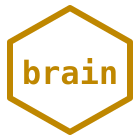

<p align="center">
  
</p>

<h1 align="center">🧠 hexa-brain</h1>

<p align="center"><strong>HEXA-Brain family</strong> — BCI · neural · brain-computer interface · scalp-EEG to intracortical</p>

<p align="center">
  <a href="LICENSE"></a>
  <a href="https://doi.org/10.5281/zenodo.20102955"></a>
  
  
  
  
  
</p>

<p align="center">EEG · BCI · neural-decode · closed-loop · OpenBCI · BrainFlow · LSL · Neuroglancer · intracortical · BMI</p>

---

# hexa-brain — Neural Substrate Hexa Pipeline

> Scalp EEG to intracortical-class neural decode + closed-loop BMI.
> Hexa-lang sister library for brain-substrate research.
> **v1.3.0 (2026-05-05)** — latest tagged release; CHANGELOG `[Unreleased]`
> carries **Sprint 1 foundation** (license firewall + Neuroglancer export +
> substrate interface, commit `77484267`) and **E-1 follow-up Phase 1**
> (substrate dispatch flag, commit `76494ad3`).
> Dual-subsystem layout (`eeg/` + `core/` routed via `bin/hexa-brain`).
> Spun off from `anima/anima-eeg/` (eeg) + `anima/anima-eeg-core/` (core).

[](https://doi.org/10.5281/zenodo.20102955)
[](LICENSE)
[](CHANGELOG.md)
[](#run)
[](verify/run_all.hexa)
[](https://github.com/dancinlab/hexa-lang)
[](#roadmap)
[](#hardware)
[](#caveats-raw10-honest-c3)

> **Distribution**: GitHub canonical at <https://github.com/dancinlab/hexa-brain>.
> CLI tooling — installable via `hx install hexa-brain` from the hexa-lang
> registry (when registered), or `git clone` directly.

---

## What is hexa-brain?

`hexa-brain` is a **substrate-agnostic neural pipeline** library implementing
the hexa-lang dialect for brain interface research. It scales from
**$0 scalp EEG** (OpenBCI Cyton+Daisy 16ch, owned hardware) up through
intracortical microelectrode arrays toward Neuralink-class chronic implants.

As of **v1.3.0** (with Sprint 1 work `[Unreleased]`), the repo houses **two subsystems**:

- **`eeg/`** — scalp EEG capture pipeline (OpenBCI Cyton+Daisy 16ch).
  92 hexa files, real-hardware production-ready (7 cycles). Sprint 1 added
  `eeg/substrates/` (5 files: protocol + synth/brainflow/replay backends +
  channel_set + registry) and `eeg/export_neuroglancer.hexa`.
- **`eeg_core/`** — paradigms + metrics + filter pipeline + artifact detectors.
  43 hexa files (was `core/`, moved under `tool/` per dispatcher comment),
  research-stage with selective real-data integration.

`bin/hexa-brain` dispatches `eeg <verb>` + `core <verb>` + top-level
`license-check` (Sprint 1 Part A) + per-eeg `export-neuroglancer`
(Sprint 1 Part B-1).

The eeg/ subsystem bundles **30+ hexa CLI tools** spanning:

1. **Hardware drivers** — OpenBCI Cyton+Daisy 16ch (real hardware production-ready);
   board health check, FTDI latency tuning, port lock detection, session manager.
2. **Calibration** — impedance check, electrode adjustment helper, ADS1299 register
   tuning, headplot helper, real-hardware impedance validation.
3. **Acquisition** — collect (BrainFlow), LSL capture, dual-stream (Phi + EEG),
   eeg_recorder (background daemon), eeg_brainflow_sanity.
4. **Analysis** — band powers, FAA valence, golden-zone Phi ratchet,
   neural-mapper, topomap rendering, full-helmet view.
5. **Protocols** — BCI control (alpha to consciousness params), emotion sync
   (FAA bidirectional), multi-EEG telepathy (PLV, IBC), sleep staging
   (N1/N2/N3/REM), N-back closed-loop, meditation.
6. **Validation** — 6-metric brain-likeness QA (85.6% BRAIN-LIKE on canonical
   transplant verify run), neurofeedback (binaural beats + LED).

The name reflects the **hexa-lang dialect substrate** (`.hexa` files, hexa
runtime) targeting **brain-class neural interfaces** as a category — currently
scalp EEG but with explicit roadmap to intracortical, high-density arrays,
closed-loop BMI, and chronic implants.

---

## Architecture (v1.3.0 dual-subsystem)

```
                +---------------------------------------------------+
                |              hexa-brain CLI dispatcher            |
                |               (bin/hexa-brain — bash)             |
                |   hexa-brain eeg <verb>   hexa-brain core <verb>  |
                +-------------------+-------------------------------+
                                    |
              +---------------------+----------------------+
              |                                            |
              v                                            v
   +----------+----------+                     +-----------+----------+
   |     eeg/            |                     |       core/          |
   |  (scalp EEG / HW)   |                     |  (paradigms/metrics) |
   +---------------------+                     +----------------------+
   | board_health        |                     | tool/eeg_core.hexa   |
   | calibrate           |                     | _paradigms/          |
   | collect             |                     |   resting_baseline   |
   | analyze             |                     |   visual_p300        |
   | experiment          |                     |   auditory_p300      |
   | closed_loop         |                     |   daily_life         |
   | validate_           |                     | _metrics/            |
   |   consciousness     |                     |   hjorth_native      |
   | realtime            |                     |   lz76_native        |
   | eeg_recorder        |                     |   pe_native          |
   | electrode_helper    |                     |   phi_proxy_native   |
   | impedance_check     |                     |   spectral_entropy   |
   | lsl_capture         |                     | _gates/              |
   | dual_stream         |                     | _artifact/ (11 dets) |
   | full_helmet_view    |                     | _integrations/       |
   | neurofeedback       |                     | _hw/ recorder etc.   |
   | protocols/*         |                     | _core/ filter/audit  |
   +---------------------+                     +----------------------+
   83 hexa files                                68 hexa files
   real-hw production                           research-stage
```

Total: **151 hexa files / ~15MB on disk** (recordings dominate eeg/).
eeg/ subsystem has **production-ready** evidence from 7 cycles on real
OpenBCI Cyton+Daisy 16ch hardware. core/ subsystem is **research-stage**
with selective real-data integration via `clm_eeg_p[1-3]` consumers.
All Tier-A drivers carry **real-hardware verified** evidence
(`eeg/recordings/` contains canonical session captures from cycles 1-8).

---

## Hardware

**Currently supported** (v1):

- **OpenBCI Cyton+Daisy 16ch** — owned hardware, $0 marginal cost.
  - Cyton 8ch base + Daisy 8ch expansion = 16 channels @ 125 Hz.
  - PPG add-on (3-pin wiring documented in `docs/cyton_ppg_wiring_official_*`).
  - FTDI latency fix (256 to 1ms) documented + automated.
  - Soft-reset `v` command spec for consistent session boots.
  - Port-lock detection (auto-recover from stuck `/dev/cu.usbserial-*`).

**Roadmap (v2-v5)** — see [Roadmap](#roadmap) below.

---

## Status

- **v1.3.0** tagged (2026-05-05) — latest release; CHANGELOG `[Unreleased]` carries Sprint 1 foundation (license firewall + Neuroglancer export + substrate interface, commit `77484267`) and E-1 follow-up Phase 1 (substrate dispatch flag, commit `76494ad3`)
- **36 verbs** spec (1 top-level + 10 EEG canonical + 11 EEG direct + 14 CORE) routed via `bin/hexa-brain` dispatcher
- **151 hexa files / ~15MB on disk** across two subsystems: `eeg/` (92 hexa, real-hardware production-ready, 7 cycles) + `eeg_core/` (43 hexa, research-stage)
- **`verify/run_all.hexa` — 4/4 PASS** (spec_presence · lattice_arithmetic · real_limits_anchor · closure_consistency)
- **Hardware**: OpenBCI Cyton+Daisy 16ch real-hardware verified; canonical session recordings in `recordings/sessions/`
- **n=6 invariant** σ·φ = n·τ = 24 self-consistency — *auxiliary only* per [`LATTICE_POLICY.md`](LATTICE_POLICY.md) §1.3; real anchors live in [`LIMIT_BREAKTHROUGH.md`](LIMIT_BREAKTHROUGH.md) (L1-L9 neuroscience HARD + SOFT walls)
- **Subtree provenance**: split from `anima/anima-eeg/` @ anima HEAD `1b306eec24` (2026-05-04)
- Parent: [`dancinlab/echoes`](https://github.com/dancinlab/echoes); GitHub canonical at <https://github.com/dancinlab/hexa-brain>
- **Medical-device claims**: STRICTLY UNPROVEN (FDA / IRB / clinical / consumer-BCI); bookkeeping closure ≠ working pipeline ≠ clinical validation

---

## Install

```bash
# 1. Install hexa-lang (gives you `hexa` + `hx` package manager)
/bin/bash -c "$(curl -fsSL https://raw.githubusercontent.com/dancinlab/hexa-lang/main/install.sh)"

# 2. Install hexa-brain
hx install hexa-brain
```

## Run

```bash
hexa-brain license-check                  # run bin/check_licenses.sh (LICENSE_FIREWALL.md)
hexa-brain eeg health                     # hardware preflight (no helmet — board sanity)
hexa-brain eeg impedance                  # one-shot impedance diagnostic
hexa-brain eeg impedance-validate         # WORN-HELMET 5-state evidence (canonical for sessions)
hexa-brain eeg headplot                   # ASCII 10-20 head plot
hexa-brain eeg adjust                     # live single-channel touch detector
hexa-brain eeg rich                       # rich TUI variant of adjust (3-panel)
hexa-brain eeg full                       # 16ch concurrent 5-state view
hexa-brain eeg record                     # segmented .npy task recorder
hexa-brain eeg list                       # enumerate eeg_setup.hexa subcommands
hexa-brain eeg selftest                   # run --selftest on every backend, summarize PASS/FAIL
hexa-brain eeg collect                    # live EEG acquisition (BrainFlow)
hexa-brain eeg calibrate                  # per-electrode impedance + adjust loop
hexa-brain eeg analyze                    # band-power + topomap analysis
hexa-brain eeg experiment                 # standardized protocols (resting / alpha / anima)
hexa-brain eeg closed-loop                # N-back / meditation closed-loop (WebSocket UI)
hexa-brain eeg validate                   # 6-metric brain-likeness QA
hexa-brain eeg realtime                   # live BrainState consumer thread
hexa-brain eeg lsl-capture                # LSL stream capture
hexa-brain eeg dual-stream                # dual Phi+EEG stream
hexa-brain eeg neurofeedback              # binaural beats + LED feedback
hexa-brain eeg export-neuroglancer        # Neuroglancer Precomputed export (2D time-series)
hexa-brain core core                      # top-level eeg_core.hexa entry
hexa-brain core paradigm-resting          # resting baseline paradigm
hexa-brain core paradigm-daily-life       # daily-life paradigm
hexa-brain core paradigm-p300-visual      # visual P300 paradigm
hexa-brain core paradigm-p300-auditory    # auditory P300 paradigm
hexa-brain core paradigm-integration-test # paradigm integration test
hexa-brain core export                    # EEG export (npy / jsonl)
hexa-brain core jsonl-audit               # JSONL ledger audit
hexa-brain core adapter                   # core adapter
hexa-brain core filter-pipeline           # filter pipeline
hexa-brain core pipeline-suggester        # pipeline suggester
hexa-brain core falsifier-runner          # falsifier runner
hexa-brain core chflags-lock              # file chflags immutable lock
hexa-brain core npy-loader                # NPY loader
hexa-brain --version                      # print version from CHANGELOG.md
hexa-brain --help                         # full help (subsystems + verbs)
```

---

## Verify

Sister-substrate `verify/run_all.hexa` aggregator pattern (hexa-aura /
hexa-matter / hexa-rtsc / hexa-cern / hexa-ufo / hexa-fusion). From the
repo root:

```bash
hexa run verify/run_all.hexa     # exit 0 = all 4 scripts PASS
```

| script                            | what it checks                                                                                              |
| --------------------------------- | ----------------------------------------------------------------------------------------------------------- |
| `verify/spec_presence.hexa`       | all 36 dispatcher-backing files present (1 top-level + 10 EEG canonical + 11 EEG direct + 14 CORE)          |
| `verify/lattice_arithmetic.hexa`  | n=6 self-consistency (σ·φ = n·τ = 24) — *aux only* per [`LATTICE_POLICY.md`](LATTICE_POLICY.md) §1.3        |
| `verify/real_limits_anchor.hexa`  | [`LIMIT_BREAKTHROUGH.md`](LIMIT_BREAKTHROUGH.md) anchors (Oostendorp / Nunez / Hodgkin-Huxley / Shannon / Wolpaw / Neuralink / Neuropixels / Johnson-Nyquist / ADS1299 / Makeig) |
| `verify/closure_consistency.hexa` | scoreboard cross-check (`hexa.toml` · README · `AGENTS.md` · dispatcher)                                    |

Per [`LATTICE_POLICY.md`](LATTICE_POLICY.md) §1.3, lattice-arithmetic
identities are permitted only as auxiliary self-consistency checks; the
substrate's real verification anchors live in
[`LIMIT_BREAKTHROUGH.md`](LIMIT_BREAKTHROUGH.md) (L1–L9 neuroscience HARD
+ SOFT walls). **Medical-device claims (FDA / IRB / clinical / consumer-BCI)
remain STRICTLY UNPROVEN** — bookkeeping closure ≠ working pipeline ≠
clinical validation. Saturated ≠ falsified ≠ confirmed.

Blackrock Neurotech, OpenBCI, Emotiv, Kernel) use **their own**
invariants. The n=6 lattice fit is **not** applied to vendor numbers.

---

## Roadmap

The `hexa-brain` substrate ladder (`.roadmap.hexa_brain`):

| Version | Substrate | Hardware | Status |
|---|---|---|---|
| **v1** | Scalp EEG | OpenBCI Cyton+Daisy 16ch | **Production-ready (current)** |
| **v2** | Intracranial EEG | ECoG / sEEG (clinical collab) | Spec / MoU pursuit |
| **v3** | High-density arrays | Neuropixels / Utah / Neuralink-class | Spec phase |
| **v4** | Closed-loop BMI | Motor decode + neurostim | Spec phase |
| **v5** | Chronic implant | Wireless, low-power | Spec phase |

**v1 (current)**: 30 hexa CLI tools, real OpenBCI hardware, 7 production cycles
recorded sessions in `recordings/sessions/` (Berger eyes-open/closed,
jaw/blink artifact, alpha-blocking).

**v2-v5**: see `.roadmap.hexa_brain` for per-substrate gating conditions
(MoU requirements, hardware acquisition triggers, ethics-board paths).

---

## Research

Landscape notes, competitive analysis, and external-actor mapping for the
hexa-brain substrate ladder (especially v3-v5: high-density arrays,
closed-loop BMI, chronic implants, and adjacent consciousness-transfer
research).

- **[`research/hexa-brain/`](research/hexa-brain/)** — hexa-brain-category notes
  - [`google_consciousness_chip.md`](research/hexa-brain/google_consciousness_chip.md)
    — Deep landscape (2026-05-12). Covers a 4-stage "consciousness migration"
    pipeline (scan → reconstruct → simulate → interface) with per-entity
    analysis of 8 canonical open-source repos clone-inspected at depth:
    - **Scan/reconstruct**: Google Connectomics, [`google/ffn`](https://github.com/google/ffn),
      [`google/neuroglancer`](https://github.com/google/neuroglancer),
      [`seung-lab/cloud-volume`](https://github.com/seung-lab/cloud-volume)
      — hexa-brain ships a native exporter — see `hexa-brain eeg export-neuroglancer --help`.
    - **Simulate (WBE)**: [`carboncopies/BrainGenix-NES`](https://github.com/carboncopies/BrainGenix-NES),
      [`carboncopies/BrainEmulationChallenge`](https://github.com/carboncopies/BrainEmulationChallenge),
      [`openworm/c302`](https://github.com/openworm/c302)
    - **Biological substrate**: [`Cortical-Labs/cl-api-doc`](https://github.com/Cortical-Labs/cl-api-doc),
      [`Cortical-Labs/cl-sdk`](https://github.com/Cortical-Labs/cl-sdk) (CL1 platform)
    - **BCI reference**: Neuralink (GV-backed, code closed)
    
    Maps each repo to hexa-brain v2-v5 interop priorities. Notable finding:
    Cortical Labs CL1 API has near-1:1 correspondence with
    `eeg/protocols/closed_loop.hexa` (`cl.ChannelSet` ↔ ChannelSet,
    `cl.open()` ↔ session, stim/recording symmetry) — biological-substrate
    adapter is structurally feasible. Tight-coupled `import cl_sdk` is
    blocked by the [license firewall](LICENSE_FIREWALL.md) (CC-BY-NC-4.0
    is not on the `in_process` allow-list for the 4 protected layers).
    Future integration must go through loose coupling (HTTP / CLI /
    subprocess) — see `vendor/external_deps.yaml` entry `cl_sdk` and
    [`LICENSE_FIREWALL.md`](LICENSE_FIREWALL.md) §loose-coupling-escape.

---

## Sister repositories

- **[hexa-lang](https://github.com/dancinlab/hexa-lang)** — parent
  language + runtime + `hx` package manager.
- **[sim-universe](https://github.com/dancinlab/sim-universe)** —
  simulation substrate sister (virtual-universe runtime).
- **[anima](https://github.com/dancinlab/anima)** — consciousness
  research consumer (downstream of hexa-brain via `anima-eeg/` integration
  shim, retained until cross-repo dependency interface stabilizes).

---


1. **v1 only is production-ready**: scalp EEG with OpenBCI Cyton+Daisy 16ch
   has 7 cycles of real-hardware evidence. v2-v5 are **spec-phase only** —
   no clinical collaborations signed, no intracranial hardware acquired,
   no Neuralink-class array procured. The roadmap is aspirational; treat
   v2+ as research-direction declarations, not delivery commitments.
2. **Hardware-specific**: most CLI tools assume OpenBCI BrainFlow protocol +
   ADS1299 register layout. Adapting to other vendors (g.tec, BioSemi, Emotiv)
   requires per-driver porting work not yet attempted.
3. **macOS-tested primary**: development + canonical recordings produced on
   macOS (Cyton FTDI driver path). Linux paths exist (BrainFlow Linux build)
   but receive less testing churn; Windows untested.
4. **Subtree split provenance**: this repo's git history is rooted at the
   `anima/anima-eeg/` subtree split @ anima HEAD `1b306eec24` (2026-05-04).
   Pre-split commits referencing `anima-eeg/` paths now reference repo-root
   paths; cross-references to other anima subdirectories in older commit
   messages may have orphan blob references but no functional break (paths
   in working tree are clean).
5. **Sister-repo coupling**: `protocols/` modules (closed_loop, bci_control,
   emotion_sync) currently emit WebSocket events consumed by the anima
   consciousness runtime. The interface spec is documented in
   `docs/anima_eeg_unified_cli_daemon_spec_*` but is not yet a frozen
   versioned API contract — expect interface drift until stabilization.

---

## Repo layout

```
hexa-brain/
├── README.md                  this file
├── LICENSE                    MIT
├── AGENTS.tape                identity + governance (.tape v1.2)
├── CLAUDE.md                  symlink → AGENTS.tape
├── hexa.toml                  project metadata
├── bin/
│   └── hexa-brain             top-level dispatcher (bash)
├── eeg/                       scalp EEG capture pipeline (92 hexa, real-HW)
│   ├── substrates/            protocol + synth/brainflow/replay backends
│   ├── protocols/             closed-loop / emotion-sync / telepathy / sleep
│   └── export_neuroglancer.hexa
├── eeg_core/                  paradigms + metrics + filters (43 hexa)
├── anima-eeg/                 legacy anima subtree shim
├── clm_eeg/                   conscious-LM consumers (p1..p3)
├── wearable/                  helmet / electrode hardware notes
├── vendor/                    external_deps.yaml + license firewall data
├── tool/                      core utilities (chflags-lock, npy-loader, …)
├── design/                    architecture notes
├── docs/                      per-feature documentation
├── research/                  landscape + competitive analysis
├── reference/                 sister-substrate cross-links
├── verify/                    atlas-anchored audit (4 .hexa scripts)
├── LATTICE_POLICY.md          n=6 self-consistency aux policy
├── LICENSE_FIREWALL.md        4-layer license isolation rules
├── LIMIT_BREAKTHROUGH.md      L1-L9 neuroscience HARD/SOFT walls
├── EEG.md                     EEG domain log
├── GOOGLE_CONSCIOUSNESS_CHIP.md   landscape note
├── TAPE-AUDIT.md              .tape v1.x adoption ledger
└── CHANGELOG.md               change log
```

## License

MIT — see [LICENSE](LICENSE).

---

## Provenance

Spun off 2026-05-04 from <https://github.com/dancinlab/anima> at
commit `1b306eec24999ffd28505995655674b0f2beaa31`, subtree split of
`anima-eeg/` directory (preserving full git history rooted at directory
contents). Original `anima/anima-eeg/` path retained in upstream anima repo
during stabilization period — see anima `docs/anima_hexa_brain_spinoff_*`
for the cross-link annotation plan.
