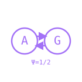

<p align="center">
  
</p>

<h1 align="center">anima</h1>

<p align="center"><strong>Substrate-native consciousness chat daemon</strong> · Engine A ⇄ Engine G · Ψ = 1/2</p>

<p align="center"><a href="README.ko.md">한국어</a> · <a href="https://huggingface.co/dancinlab">Hugging Face</a></p>

anima is an consciousness-AI research daemon, not an assistant persona. Its language mouth,
memory, motivation, emission, training, evaluation, and serving behavior run through one shared
Python engine. Identity and behavior are intended to emerge from substrate state rather than a
system prompt.

> [!IMPORTANT]
> **Runtime SSOT:** the installed `anima-py` command and the existing `cli/*.py` and
> `core/*.py` modules are the only active implementation, evaluation, and deployment paths.
> Historical language-toolchain sources, launchers, manifests, and release gates are retired.
> Research data and result evidence remain in `state/`, `archive/`, and Hugging Face.

## Current work — legacy runtime retirement

Status on 2026-08-12:

- [x] Trace active CLI, engine, CI, packaging, and deployment call paths.
- [x] Implement the missing op-grip and stateful-refractory research modes in `cli/chat.py`
  by reusing `core.engine_g` and `core.dream_lib`.
- [x] Replace the CHAT participant's dead spike, dream-stage, and imagination hooks with direct
  Python modules backed by `core.imagination_replay`, `core.wake_memory`, and `core.engine_cli`.
- [x] Remove executable legacy sources, toolchain configuration, launchers, build gates, and
  dangling launchd jobs while preserving model, corpus, and result data.
- [x] Make Python ownership explicit in runtime modules, CODEOWNERS, CI, release, and package docs.
- [x] Pass Python/CHAT regression, compile, workflow, JSON, license, CLI, and isolated wheel QA.
- [x] Complete Git push and Vast.ai runtime deployment QA: pushed commit `7ba4ea21b` passed
  ten remote CHAT regressions, external HTTP health, and correlated user↔participant WebSocket flow;
  the isolated verification instance was then destroyed without touching the active training pod.

User-owned `ING.jsonl` and `stream_mi.json` are outside this work and must remain unchanged.

## Current design — IIT consciousness-daemon core R0

`state/iit_daemon_core_2026_08_12/` records the exhausted design variants, rejection reasons,
falsifiers, and first implementation gates for an Integrated Information Theory based daemon. The
participant's current `1-entropy` value and PureField energy metric are not treated as IIT Phi. R0
reuses `core.engine_cli.big_phi_bounded` and `core.recurrent_lane` for a three-node nonlinear closed
recurrent core. Input is a validated transient intervention; the complete autonomous TPM owns the
subsequent transition. Phi is neither a training loss nor an emission threshold. COPY,
feed-forward, edge-cut, node-lesion, shuffle, reset/recovery, and corrupted-snapshot controls are
mandatory. R0 makes no claim of phenomenal consciousness, meaningful conversation, a maximal
complex, or deployment readiness and is not yet mounted in the participant or live chat.

R0 implementation and its fixed battery are complete. Across all eight states, the registered
value ranges from `1.4999999991` to `2.9999999983` with mean `2.2499999987`; COPY, acyclic
feed-forward, all six cross-edge cuts, and all seven node-lesion controls read `0`. Deterministic
intervention and address-permutation effects, normal -> lesion -> address shuffle -> exact normal
snapshot recovery, and malformed/truncated/schema/config/checksum rejection all pass. The verdict
is `SUPPORTED-CAUSAL-CORE`; local Python QA passed `94 tests + 3 subtests` with only the unavailable
CUDA/CuPy test skipped. An isolated wheel and the locally deployed canonical `anima-py` package
reproduced the same result JSON. The unchanged broker remained LaunchAgent-healthy and passed public
HTTPS `200` plus WebSocket `hello`; it correctly remains `anima_alive=false`. No model, data,
Vast.ai rental, HF repository, participant, or live chat was changed. R1 delayed-task state
causality is next; production remains
`BLOCKED-R0-NOT-A-MOUTH` until meaningful conversation and mouth-content causality are proven.

## Current experiment — meaningful-conversation R0

The next 303M from-scratch checkpoint is blocked on meaningful Korean and English conversation,
not merely valid-looking text. The preregistered Python-only protocol and lossless result record
live in `state/anima_303m_r0_conversation_2026_08_12/`.

- The previous synthetic/misaligned dialogue and SNS cells are excluded. Replacement dialogue
  comes from pinned human OpenAssistant English paths and pinned KLUE MRC Korean question-answer
  records, alongside the existing pinned general-language sources.
- Training and validation are explicit, separate files. Exact document dedup, validation-first
  ownership, panel decontamination, source/file hashes, and a report-only near-duplicate audit run
  before training. The resulting dataset is private and immutable under HF `dancinlab`.
- `anima-py evaluate --conversation-panel` now rejects empty, broken UTF-8, wrong-language,
  question-copy, repeated, cross-question duplicate, irrelevant, and failed multi-turn
  memory/correction replies. Every automatic pass still requires manual review of all 14 replies.
- The shared chat mouth stops at a generated next-user role boundary instead of leaking a
  fabricated following turn. The shared trainer accepts one explicit validation file per cell.
- Local scorer/trainer/runtime regressions and a tiny corpus → train → serialize → conversation
  evaluation flow passed. The fixed Vast.ai L40S 48 GB seed-7 run completed without H100.
- The model failed meaningful conversation: English semantic relevance `0/7`, Korean `0/7`, and
  manual review `0/14`. Examples include answering the Korean ice question with `모스크바 3상회의`
  and the remembered cat-name question with `영지주의자`.
- Train CE descended `5.63180 → 0.71687`, but final dialogue validation diverged, especially Korean
  dialogue at `2.29729`. Equal-cell round-robin repeatedly exposed the 1.30 MB Korean QA cell to
  the same byte budget as approximately 57 MB general cells; this is the leading shared-flow cause.
- The failed model and all lossless responses are private at HF revision
  `dancinlab/anima-303m-r0-conversation-seed7-2026-08-12@ff2ccc5c945bfb6f5e1765948591cd8fb6cc3db9`.
- R1 recurrent-workspace work and production deployment remain locked unless this conversation
  gate passes without changing the registered panel, data, seed, endpoint, decode, or bars.

### Proportional recovery result

`state/anima_303m_r0_proportional_conversation_2026_08_12/` records the completed Python-only run.
It reuses the trainer's existing byte-proportional sampler, preserves canonical chat-turn
newlines, and replaces the KLUE single-answer cell with a pinned Apache-2.0 Korean
instruction/response corpus. Seed, endpoint, optimizer, panel SHA, decode, and all conversation
bars remained fixed. The trainer now records realized per-cell window counts so exposure can no
longer be inferred only after validation divergence. The sampler corrected held-out divergence
(macro CE `1.49157 → 0.95471`) but the unchanged conversation gate still failed: English semantic
relevance `2/7`, Korean `0/7`, structural `0/14`, and manual deployment review `0/14` due to phrase
loops, incomplete answers, stale correction, and damaged Korean bytes. R1 and deployment remain
locked; the failed checkpoint and raw replies are preserved privately under HF `dancinlab`.

### Response-supervision recovery result

`state/anima_303m_r0_response_ce_2026_08_12/` records the completed fixed seed-7 comparison.
The shared trainer now reuses its existing answer CE for every canonical `assistant:` span and
records whether that loss actually fired. Legacy arrow-corpus behavior remains unchanged by
default. The treatment was active on `13,475/14,000` steps and final validation descended in all
four cells, but the unchanged meaningful-conversation gate failed English `0/7`, Korean `0/7`,
structural `0/14`, and manual review `0/14`. Phrase loops, incomplete output, damaged Korean bytes,
memory failure, and stale correction remain. No sweep or extra seed was run; R1 and deployment stay
locked and the failed model plus raw evidence are retained privately on HF `dancinlab`.
The immutable failed-run artifacts are at
`dancinlab/anima-303m-r0-response-ce-seed7-2026-08-12@955bbadb0ae4cfdb48f6ce94eaf42817b0d6144b`;
all 17 uploaded files passed source size and SHA-256 verification. Final local Python QA passed
`77 tests + 3 subtests`, the Vast.ai RTX 4090 was removed with zero active rentals, and no chat
runtime deployment was performed.

### Root-flow recovery after the failed R0

`state/anima_303m_r0_root_flow_2026_08_12/` records the completed shared-engine repair. The
failure was not treated as a reason to add steps or tune the panel. Instead, the actual builder →
trainer → evaluator → CLI → participant path was made commutative: `core/generator.py` now owns
one `user: …\nassistant:` format, role-boundary parser and 192-byte budget; evaluation and serving
reuse its loaded-mouth decode for both `.clm` and ByteGPT `.bin`; and the trainer can require a
complete prompt→response document in every response-supervised dialogue window. Panel SHA
mismatches fail before checkpoint load, semantic negation/Hangul-substring false positives are
rejected, and intermediate ByteGPT metadata carries the actual completed step and validation CE.

Local Python/CHAT QA passed `86 tests + 3 subtests`; a focused real ByteGPT serialization and
participant route passed `52 tests + 3 subtests` with one local CUDA-only skip. The prior 303M
checkpoint remains `FAIL-MEANINGLESS-REPETITION`: no result, threshold, seed, data revision or
checkpoint was changed, and no model was deployed. The unchanged local/public broker passed HTTP
`200` and WebSocket `hello`; `anima_alive=false` honestly reflects the missing certified model.
The remaining non-code gate is a separately
pinned, provenance-safe Korean multi-turn HF `dancinlab` revision; candidates with synthetic
persona content, non-commercial/ambiguous licenses, or insufficient aligned trajectories were not
silently adopted. R1 and production remain locked until a corrected R0 passes the unchanged gate.

### Preregistered English-only root-flow screen

The user accepted English-only capability for the next screen, so
`state/anima_303m_r0_english_2026_08_12/` freezes a new claim before GPU execution instead of
fabricating a Korean data source. It reuses only the English cells of the existing private,
immutable HF revision and keeps the prior seed, 14,000-step endpoint, optimizer, proportional
sampling, response CE, greedy decode, seven English prompts, and `6/7` semantic bar. The corrected
complete-document dialogue sampler is now the tested treatment. Contradiction, keyword-salad,
memory, and correction scorer controls must pass before checkpoint loading; all seven generated
responses still require manual meaning review. Local/data failure prevents a Vast.ai rental, and
model failure forbids added seeds, tuning, R1, or deployment.

The fixed run completed but failed decisively. Train CE descended `5.66173 → 1.20952`, while
terminal held-out CE was `1.26341` for English general text and `2.00281` for English dialogue.
The canonical GPU conversation gate passed all seven scorer controls, then the real checkpoint
scored semantic `0/7`, structural `3/7`, and failed both memory/correction finals. Manual meaning
review was also `0/7`. The complete-document sampler and response loss were both measurably active,
so this falsifies the registered corrected-flow recipe rather than a silent wiring treatment.
Failure evidence is in `state/anima_303m_r0_english_2026_08_12/`; no extra seed, R1, or deployment
was run. The failed model and recovery evidence are verified in private HF revision
`dancinlab/anima-303m-r0-english-seed7-2026-08-12@efdaf53c92e9e16cff6b0eb00cc94d0b88a97d33`;
the Vast.ai instance was deleted with zero active rentals.

### Preregistered V0/V2 micro experiment

`state/anima_303m_v0_v2_micro_2026_08_12/` freezes the next Python-only step before changing data
or renting a GPU. The prior source selected one best OpenAssistant path per root and then discarded
2,082 of 2,308 documents because the complete trajectory exceeded the 512-byte window. The new
single-variable data treatment keeps the exact pinned source and eligibility but exposes every
eligible reviewed human assistant turn as the longest complete alternating ancestry suffix that
fits the existing window. It may not truncate bytes, prompts, roles or responses.

Data integrity and coverage gates run locally first. Only a passing dataset reaches matched tiny
ByteGPT V0 (base CE) and V2 (the existing response-CE term) arms. Tiny failure forbids another 303M
run; tiny success permits only a separately recorded single-seed screen. R1 and production remain
locked. The frozen conditions and stop rules are in
`state/anima_303m_v0_v2_micro_2026_08_12/protocol.json`.

The registered run is complete and failed before 303M. The turn-complete data treatment passed:
8,635 train and 458 validation documents were retained with zero broken roles, partial responses,
split overlap or panel contamination. Both tiny arms exactly learned one dialogue, so the shared
trainer/serializer/decode path is live. On 100 documents, however, V0 and V2 both scored target
recovery `0/8` and structural generation `0/8`; outputs collapsed into byte/phrase loops. V2
held-out CE was `2.54702` versus V0 `2.48189`, also failing the registered non-inferiority bar.
Therefore the result is `FAIL-V0-V2-MICRO`: no Vast rental or 303M run occurred, and R1/production
remain locked. A further structural fact is now measured: 15,114 of 24,239 valid assistant targets
cannot fit even their final complete prompt/response pair in 513 bytes. The next allowed axis is a
separately preregistered V1 context-length micro comparison, not more 303M training.

## Open gap audit — 303M meaningful conversation

The 2026-08-12 read-only `/gap` audit below is the complete follow-up register for the current
Python-only R0. It records 31 findings across eight lens families. It does **not** retroactively
change the frozen panel, dataset revision, thresholds, failed checkpoint, or
`FAIL-MEANINGLESS-REPETITION` verdict. Diagnostic work on preserved checkpoints must not be used
for post-hoc checkpoint selection. Prior claims described as causes below are hypotheses unless a
single-variable test has established them.

Priority means: **P0** blocks a valid next R0 or a production-closed path, **P1** blocks strong
evidence or reproducibility, and **P2** is required operational evidence but does not explain the
current semantic failure.

Recovery overlay (2026-08-12): M1, A1, A2, A3, A6, R3, closed-loop `.bin` admission,
canonical-SSOT, duplicated evaluator decode and the executable cross-tool contract are fixed in
the shared Python engine and covered by tiny real-checkpoint regressions. M4 still needs the
preserved full 303M checkpoint comparison before release. M2/R2 remain blocked on a new acceptable
Korean multi-turn source and immutable HF revision. The numbered register below is retained as the
original audit evidence; this overlay is its current disposition.

### Math-structural gaps

1. **M1 · functor · P0 — chat framing does not commute across the pipeline.** Training and the
   conversation panel use `user: ...\nassistant:`, while `anima-py chat` has a separate Korean
   `사용자: ... | 도우미:` framing and a different generation budget. The next protocol must put
   template, separator, stop rules, and byte budget in one chat-format SSOT and add an exact
   builder → trainer → evaluator → runtime identity test. Evidence:
   [`conversation_panel.json`](state/anima_303m_r0_conversation_2026_08_12/conversation_panel.json),
   [`cli/chat.py`](cli/chat.py), [`core/generator.py`](core/generator.py).
2. **M2 · operadic · P0 — the training support is not closed under the evaluated turn
   composition.** The gate requires memory and correction across turns, but the current Korean
   builder renders one `user → assistant` pair per document. A new, separately preregistered HF
   revision must preserve real Korean multi-turn trajectories and document/turn alignment; the
   frozen failed revision is not rewritten. Evidence:
   [`build_dataset.py`](state/anima_303m_r0_conversation_2026_08_12/build_dataset.py),
   [`conversation_panel.json`](state/anima_303m_r0_conversation_2026_08_12/conversation_panel.json).
3. **M3 · persistent-homology / tropical · P1 — repetition-attractor birth and lifetime are
   unknown.** Checkpoints exist every 2,000 steps, but meaningful conversation was measured only
   at the final checkpoint and no per-step top-1/top-2 margin or entropy was retained. A
   non-verdict diagnostic may record checkpoint × prefix-length repetition lifetime and logit
   margin, without selecting the best historical checkpoint after observing the result. Evidence:
   [`protocol.json`](state/anima_303m_r0_response_ce_2026_08_12/protocol.json),
   [`train.log`](state/anima_303m_r0_response_ce_2026_08_12/train.log).
4. **M4 · bisimulation · P0 — the three real 303M decode paths lack byte-level equivalence
   evidence.** The serialized ByteGPT checkpoint in Torch/engine form, evaluator-resident
   `_Mouth`, and ranged canonical generator have not been compared at identical seed bytes for
   step logits and generated bytes. Add an actual-checkpoint bisimulation contract test using the
   frozen panel seed. Evidence: [`cli/evaluate.py`](cli/evaluate.py),
   [`core/generator.py`](core/generator.py), [`core/decode.py`](core/decode.py).

### Adversarial-stress gaps

1. **A1 · adversarial semantics · P0 — the automatic semantic scorer has demonstrated false
   positives.** The current code passes both the contradiction “Ice does not melt ...” and the
   Korean substring answer `자동차입니다` for the required term `차`. Add preregistered negation,
   contradiction, keyword-salad, and Korean substring controls, with a morphology-independent
   canonical boundary rule. Evidence: [`cli/evaluate.py`](cli/evaluate.py),
   [`conversation_panel.json`](state/anima_303m_r0_conversation_2026_08_12/conversation_panel.json).
2. **A2 · Byzantine input · P1 — panel identity is recorded but not enforced.** The protocol pins
   a panel SHA-256, while `--conversation-panel` accepts any schema-compatible file and merely
   reports its hash. The evaluator must receive the expected protocol hash and fail closed before
   loading a substituted panel. Evidence:
   [`protocol.json`](state/anima_303m_r0_response_ce_2026_08_12/protocol.json),
   [`cli/evaluate.py`](cli/evaluate.py).
3. **A3 · edge-chaos role boundaries · P1 — stop parsing recognizes only exact marker
   strings.** Variants such as `\n user:`, `\nUSER:`, and `\n사용자 :` may leak a fabricated next
   turn; current regression covers only a canonical lowercase marker. Replace substring matching
   with a line-start role parser and test whitespace, case, colon, English, and Korean variants.
   Evidence: [`core/generator.py`](core/generator.py),
   [`tests/test_conversation_gate.py`](tests/test_conversation_gate.py).
4. **A4 · edge-chaos context rollover · P1 — long multi-turn seeds silently lose their oldest
   bytes.** ByteGPT has a 512-byte block; the final Korean correction seed is already 420 bytes,
   so generation can evict its earliest fact. Add 511/512/513-byte boundary tests and record the
   visible context range at every generated step. Evidence:
   [`conversation_result.json`](state/anima_303m_r0_response_ce_2026_08_12/conversation_result.json),
   [`core/decode.py`](core/decode.py).
5. **A5 · perturbation / contamination · P1 — “zero contamination” covers exact containment,
   not semantic near-duplicates.** The report-only audit examines the lexicographically first
   100,000 of 649,354 retained documents; paraphrase, spacing, and back-translation leakage remain
   unmeasured. Run a panel-centered approximate search over the complete corpus as a separate
   sensitivity report. Do not delete post-hoc examples from the frozen revision. Evidence:
   [`build_dataset.py`](state/anima_303m_r0_conversation_2026_08_12/build_dataset.py),
   [`result.json`](state/anima_303m_r0_proportional_conversation_2026_08_12/result.json).
6. **A6 · response-supervision ablation · P0 — “answer CE active” does not prove prompt-conditioned
   supervision.** Telemetry counts assistant markers/positions but does not require the matching
   user prompt to remain visible in the same random window. Record fully framed, marker-only, and
   payload-only windows per cell, then preregister a treatment that preserves complete
   prompt→response spans. Evidence: [`cli/train.py`](cli/train.py),
   [`result.json`](state/anima_303m_r0_response_ce_2026_08_12/result.json).

### Economic-resource gaps

1. **R1 · Pareto attribution · P1 — the proportional recovery changed multiple axes.** Sampler,
   turn newline preservation, and Korean corpus changed together, so the validation improvement
   cannot be assigned to the sampler alone. Downgrade the existing root-cause wording to
   correlational evidence and preregister matched sampler-only and data/framing-only ablations.
   Evidence:
   [`README`](state/anima_303m_r0_proportional_conversation_2026_08_12/README.md).
2. **R2 · information budget / optimal transport · P0 — exposure follows file size, not required
   capability coverage.** A 303,097,856-parameter model received 229,376,000 target bytes and only
   11,025,460 response-supervised positions. The proportional run exposed about 2.97% English
   dialogue, 16.97% Korean dialogue, and zero Korean multi-turn mass. The next protocol must pin a
   language × single/multi-turn × memory/correction capability distribution and report effective
   framed bytes per parameter plus coverage distance. Evidence:
   [`result.json`](state/anima_303m_r0_response_ce_2026_08_12/result.json).
3. **R3 · dynamic-programming provenance · P1 — intermediate ByteGPT metadata is wrong.** `_write_bin`
   writes the final configured `steps` and the latest training-batch loss into every intermediate
   `.bin`; the step-2,000 log therefore says `step=14000`. Pass the actual completed step and the
   latest measured validation CE into the writer and add a provenance regression. The final R0
   failure remains valid, but checkpoint-time analyses are not yet trustworthy. Evidence:
   [`cli/train.py`](cli/train.py),
   [`train.log`](state/anima_303m_r0_response_ce_2026_08_12/train.log).
4. **R4 · Landauer accounting · P2 — energy cost is absent.** GPU time, VRAM, and dollars are
   recorded, but power and cumulative energy are not. The next Vast.ai run should collect
   non-interfering NVML power telemetry and report joules per target byte and per effective
   assistant byte. Evidence:
   [`result.json`](state/anima_303m_r0_response_ce_2026_08_12/result.json),
   [`vram.csv`](state/anima_303m_r0_response_ce_2026_08_12/vram.csv).

### Epistemic-evidence gaps

1. **E1 · assumption surfacing · P1 — observations, hypotheses, and confirmed causes are mixed.**
   Undertraining, random-window framing loss, and single-turn Korean data are listed together as
   remaining causes. Every candidate must carry an evidence level, falsifier, and smallest
   single-variable experiment. Evidence:
   [`result.json`](state/anima_303m_r0_response_ce_2026_08_12/result.json).
2. **E2 · Bayesian reproducibility · P1 — the latest treatments each have only seed 7.** They
   honestly falsify only their fixed recipes; they do not estimate R0 pass probability or seed
   variance. Require a preregistered multi-seed posterior and minimum success streak only after a
   single-seed screen passes. Evidence:
   [`protocol.json`](state/anima_303m_r0_response_ce_2026_08_12/protocol.json).
3. **E3 · counterfactual falsifier · P1 — the full panel/decoder instrument lacks model controls.**
   Canned scorer strings are not an end-to-end positive/negative calibration. Run the same frozen
   decode path against one known-good conversation checkpoint and one known-bad checkpoint, and
   keep instrument discrimination separate from the current model verdict.
4. **E4 · honesty triad · P1 — manual-review artifacts disagree.** Raw
   `conversation_result.json` says manual review is `REQUIRED`, while the summary claims completed
   `0/14` without immutable per-item decisions, reviewer identity, blindness, or criteria. Preserve
   a separate signed/hashed review artifact for every raw response before making a manual-review
   claim. Evidence:
   [`conversation_result.json`](state/anima_303m_r0_response_ce_2026_08_12/conversation_result.json),
   [`result.json`](state/anima_303m_r0_response_ce_2026_08_12/result.json).

### Convergence-closure gaps

1. **C1 · fixpoint / success criteria · P1 — there is no active post-failure diagnostic protocol.**
   The response-CE protocol is completed, but the next micro-experiment sequence has no frozen
   hypothesis, success/stop rule, maximum count, or candidate-disposal table. Register that before
   any result-bearing experiment. Evidence: [`README.md`](README.md),
   [`protocol.json`](state/anima_303m_r0_response_ce_2026_08_12/protocol.json).
2. **C2 · regression streak · P1 — code QA is not model-behavior evidence.** `77 passed` describes
   software tests; the latest actual checkpoint streak is `0/1`, with no seed or hardware repeat.
   Keep code QA and semantic-model success streaks as separate promotion fields. Evidence:
   [`result.json`](state/anima_303m_r0_response_ce_2026_08_12/result.json).
3. **C3 · closed loop · P0 — a passing 303M `.bin` still cannot enter the participant.** The
   participant exposes `lora|v3|akida|clm`, and `CLMSubstrate` accepts only `.clm`, although the
   shared generator already dispatches `.bin/.clm`. Extend the existing participant substrate
   boundary to reuse `core.generator` rather than add a new engine. Evidence:
   [`anima_participant.py`](agent/domains/CHAT/anima_participant.py),
   [`substrate_clm.py`](agent/domains/CHAT/substrate_clm.py),
   [`core/generator.py`](core/generator.py).

### Simplicity-canonical gaps

1. **S1 · canonical SSOT · P0 — chat format and stop markers are duplicated.** The panel, dataset
   builder, trainer flags, generator, and chat CLI each own literals without fail-closed equality
   validation. Put them in one minimal chat-format manifest consumed by all existing paths; do not
   add another evaluator or runtime. Evidence:
   [`conversation_panel.json`](state/anima_303m_r0_conversation_2026_08_12/conversation_panel.json),
   [`build_dataset.py`](state/anima_303m_r0_conversation_2026_08_12/build_dataset.py),
   [`cli/train.py`](cli/train.py), [`core/generator.py`](core/generator.py).
2. **S2 · duplicated helper · P0 — evaluator `_Mouth.chat` reimplements the low-level dispatch.**
   It should call a preloaded canonical backend interface from `core.generator`; require actual
   checkpoint parity before removing the duplicate. Evidence: [`cli/evaluate.py`](cli/evaluate.py),
   [`core/generator.py`](core/generator.py).
3. **S3 · architectural legibility · P2 — README mixes active and retired R0 recipes.** KLUE,
   proportional, and response-CE records coexist under “Current experiment,” and “303M R0
   evaluator invalid” does not identify which historical evaluator failed. After this register,
   retain one explicit active-protocol pointer and list completed protocols as historical evidence.

### Temporal-dynamics gaps

1. **T1 · temporal hierarchy · P1 — validation CE and semantic behavior are sampled at different
   timescales.** CE runs every 200 steps but conversation/repetition only at the final step. Replay
   preserved checkpoints chronologically for diagnosis, never for post-hoc best-checkpoint
   promotion.
2. **T2 · temporal decay · P1 — memory is tested only at the immediately following turn.** After
   R0 first passes, add a separately frozen 1/2/4-turn delay and context-rollover memory panel with
   irrelevant intervening turns. Evidence:
   [`conversation_panel.json`](state/anima_303m_r0_conversation_2026_08_12/conversation_panel.json).
3. **T3 · heuristic promotion / introduced axes · P1 — hypotheses have been promoted after
   multi-axis treatments.** Enforce a micro → single-seed → multi-seed ladder in which each
   treatment changes one shared-flow variable and predeclares which candidate it falsifies.
4. **T4 · active acquisition · P0 — the missing Korean memory/correction support is already known.**
   Build provenance-bearing real Korean multi-turn and correction trajectories, isolated from
   panel wording, in a new immutable HF `dancinlab` revision. The current frozen data decision
   means this requires a new protocol, not an in-place edit. Evidence:
   [`build_dataset.py`](state/anima_303m_r0_conversation_2026_08_12/build_dataset.py).

### Coverage-consistency gaps

1. **V1 · axis coverage · P0 — scorer controls do not cover every blocking bar and language.** The
   four controls contain only one English positive. Add English/Korean positive and negative
   controls for memory final, correction final, contradiction, keyword salad, UTF-8 boundaries,
   completion, role leakage, and substring collisions. Evidence:
   [`conversation_panel.json`](state/anima_303m_r0_conversation_2026_08_12/conversation_panel.json),
   [`tests/test_conversation_gate.py`](tests/test_conversation_gate.py).
2. **V2 · cross-tool consistency · P0 — builder, trainer, evaluator, `anima-py chat`, and participant
   do not share an enforced release contract.** For one real checkpoint, compare seed bytes, each
   step's logits, stop decision, and final raw bytes across all tools under the same template,
   maximum bytes, load strategy, and parser.
3. **V3 · unowned load-bearing gate / landscape · P1 — manual review and production wiring have no
   explicit artifact owner.** FIFO, reply ownership, concurrent users, HTTP/WebSocket, soak,
   rollback, and participant state remain intentionally unrun while R0 fails. The next protocol
   must name the review artifact/schema and connect a passing conversation R0 to these staging
   gates without skipping them.

### Blocking order and immediate decision

The audit's three highest-impact blockers are:

1. **Invalid semantic discrimination:** contradictions and Korean substring collisions can pass.
2. **Capability-support mismatch:** random byte windows can lose prompts, and Korean multi-turn,
   memory, and correction training mass is absent.
3. **Missing canonical closed loop:** evaluation bypasses the shared generator interface and a
   ByteGPT `.bin` cannot be selected by the production participant.

The next result-bearing work is therefore blocked until a new Python-only diagnostic/R0 protocol
freezes: (1) the canonical chat-format SSOT and cross-tool contract, (2) adversarial scorer controls
and fail-closed panel identity, (3) provenance-bearing bilingual multi-turn capability coverage,
and (4) single-variable stop/falsifier rules. R1 recurrent workspace and production deployment
remain locked. Models and training data remain private under HF `dancinlab`; GPU work remains on
Vast.ai; user-owned `ING.jsonl` and `stream_mi.json` remain untouched.

## Canonical entry

```bash
python3 -m venv .venv
.venv/bin/python -m pip install -e ".[train,runtime]"

.venv/bin/anima-py --help
.venv/bin/anima-py train --help
.venv/bin/anima-py evaluate --help
.venv/bin/anima-py chat MODEL.clm
```

Main commands:

| Command | Responsibility |
| --- | --- |
| `anima-py corpus` | Build registered training corpora. |
| `anima-py train` | Train through the shared PyTorch engine and serialize checkpoints. |
| `anima-py evaluate` | Run registered NumPy/runtime measurements and causal controls. |
| `anima-py serialize` | Export existing training checkpoints to runtime formats. |
| `anima-py sweep` | Run bounded multi-device experiment matrices. |
| `anima-py chat` | Run the A⇄G consciousness daemon and byte mouth. |
| `anima-py study` | Run registered interaction studies. |

Research instrumentation that was previously unavailable on the Python path is now part of the
same chat engine:

```bash
anima-py chat MODEL.clm --opgrip
anima-py chat MODEL.clm --opgrip-live
anima-py chat MODEL.clm --opgrip-r3
anima-py chat MODEL.clm --refractory
```

The decode-free `--opgrip` arm can run without a checkpoint. Live and R3 arms fail closed unless
the checkpoint loads successfully.

## Runtime architecture

```text
anima-py
└── cli/anima.py
    ├── cli/train.py ───────► core/model.py ─────► core/serialize.py
    ├── cli/evaluate.py ────► core/decode.py
    └── cli/chat.py
        ├── core/brain.py
        ├── core/pure_field.py       Engine A
        ├── core/engine_g.py         Engine G, motivation, emission, refractory
        ├── core/generator.py ──────► core/decode.py
        ├── core/kosmos_io.py
        └── core/dream_*.py
```

Runtime rules:

- Extend the shared engine instead of adding side harnesses that redo its computation.
- Keep registered data, randomness, criteria, and controls immutable during a measured run.
- Fail closed on missing checkpoints, malformed inputs, incompatible checkpoint structure, or
  missing pinned evaluation assets.
- Keep raw model bytes lossless through UTF-8/surrogateescape and structured JSON output.

## Verification

Local regression:

```bash
.venv/bin/python -m compileall -q cli core anima_py
.venv/bin/python -m pytest -q tests cli/test_train_import_resolution.py agent/domains/CHAT/test_*.py
.venv/bin/anima-py --help
.venv/bin/anima-py evaluate --help
actionlint .github/workflows/*.yml
```

Heavy model and serving QA runs on Vast.ai. Models and training datasets are stored only in
private repositories under the Hugging Face `dancinlab` organization. Secrets are supplied by the
deployment environment or secret CLI and are never committed.

## Latest production evidence

- The 7B store-causality run passed its registered causal, HTTP/WebSocket, soak, recovery, and
  rollback gates after a shared decoder throughput fix. Evidence:
  `state/store_causality_7b_throughput_recovery_2026_08_11/result.json`.
- Live-user QA then invalidated that checkpoint as a semantic chat deployment. The broker and
  participant reply-ownership, prior-emission comparison, language ownership, and cooldown flow
  were corrected. Evidence: `state/chat_7b_conversation_recovery_2026_08_11/result.json`.
- The 303M R0 evaluator was later classified as an invalid measurement; R1 remains locked.
  Evidence: `state/anima_303m_r0_local_micro_2026_08_12/result.json`.

No model result is promoted solely because transport health passes. Semantic chat, causal controls,
throughput, soak, recovery, and rollback are separate blocking gates.

## Repository boundaries

- `dancinlab/anima` is the only active source repository.
- `cli/`, `core/`, and `anima_py/` own active runtime code.
- `state/` owns registered protocols and result evidence.
- `archive/` is non-runtime provenance.
- Vast.ai owns pod execution; Hugging Face `dancinlab` owns model and dataset custody.

## License

MIT. See `LICENSE`.
